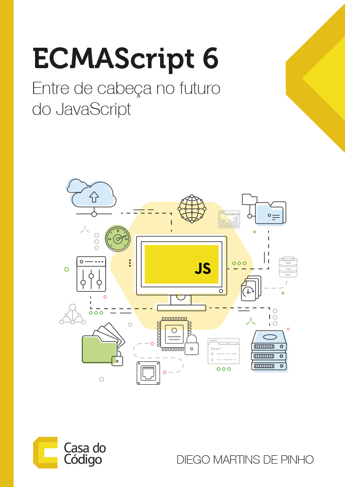

ECMAScript 6 - Entre de cabeça do futuro do JavaScript
======================

Seja muito bem-vindo a uma nova era do JavaScript! O ECMAScript 6 é a maior evolução da linguagem desde a sua criação há 20 anos! Ela agora está muito mais dinâmica, clara e gostosa de se trabalhar. Neste repositório, você encontrará todos os recursos disponíveis para acompanhar a leitura do livro "ECMAScript 6: Entre de cabeça no futuro do JavaScript".

Sobre o repositório
------
Este repositório contém exercícios resolvidos do livro ECMAScript 6: Entre de cabeça no futuro do JavaScript.

Dados do livro
------
**Número de páginas:** 206 

**ISBN:** 978-85-5519-258-6

------
**ECMAScript 6 - Entre de cabeça no futuro do JavaScript** © 2017+, Diego Martins de Pinho. Publicado pela editora [Casa do Código](https://www.casadocodigo.com.br/). Todos os direitos reservados.

> Site oficial [entendendoes6.com.br](http://entendendoes6.com.br) &nbsp;&middot;&nbsp;
> Twitter [@entendendoes6](https://twitter.com/entendendoes6) &nbsp;&middot;&nbsp;
> Facebook [/entendendoes6](https://www.facebook.com/entendendoes6/) &nbsp;&middot;&nbsp;